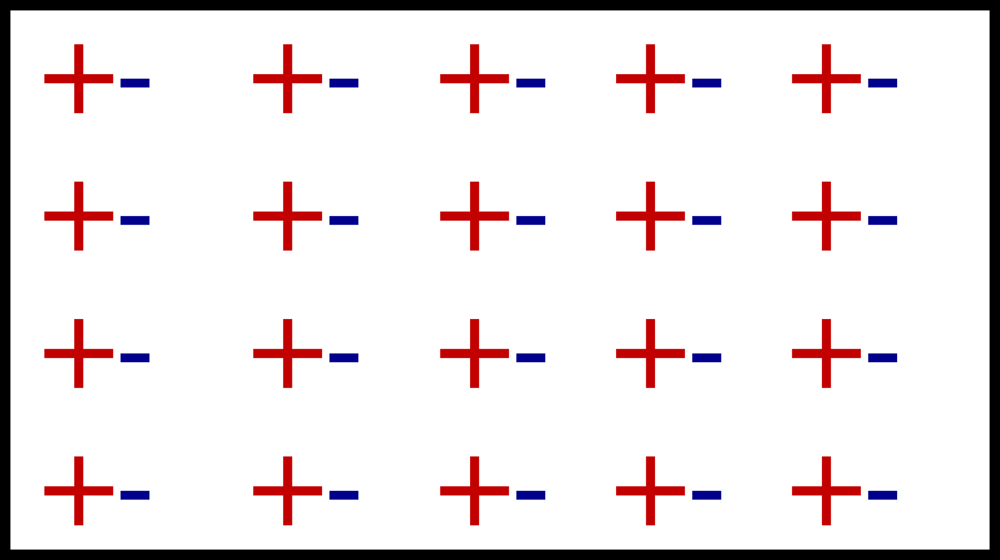
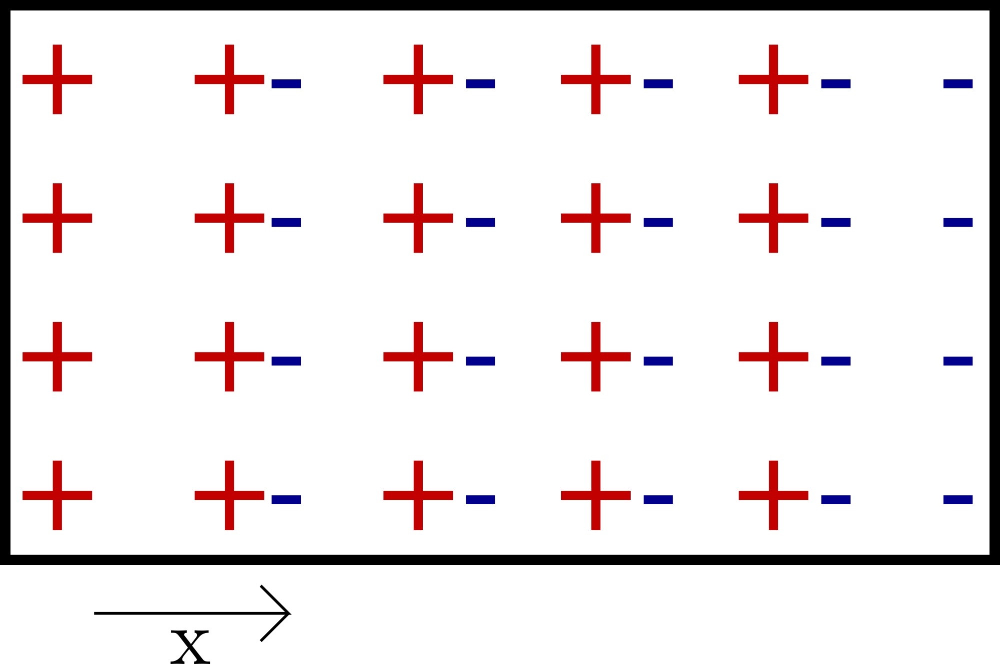

*****
Units
*****

:math:`\texttt{Bolt}` handles dimensionless quantities normalized using some reference quantities. It's to be ensured that all input quantities are normalized appropriately when passing to ``physical_system``. This is to be done under the parameter and domain files under the respective problem folder.

Let us now illustrate this choice of normalization that can be adapted, when dealing with a purely collisonless case with electrostatic fields. Note that this is just one of the possible ways in which the independant units can be arrived at:

The equations governing by the system under consideration is given by:

.. math::
  \frac{\partial f}{\partial t} + v \frac{\partial f}{\partial x} + \frac{qE}{m} \frac{\partial f}{\partial v} = 0 \\
  E = -\frac{\partial \phi}{\partial x} \\
  \nabla^2 \phi = - \frac{\rho}{\epsilon_0} = - \frac{n e}{\epsilon_0}

- As we'd stated earlier, we have a choice of declaring a few variables with respect to absolute reference quantities(independant quantities), and find that the remaining dependant quantities can be expressed in terms of these. For this example, we'll choose appropriate reference units for time :math:`t`, velocity :math:`v`, charge :math:`e` and mass :math:`m`.

- When dealing with a plasma at constant mean density :math:`n_e` , it is convenient to normalize times by introducing the electron plasma frequency :math:`\omega_{pe} = \sqrt{\frac{ne^2}{m \epsilon_0}}`. Then all times are normalized using :math:`{\omega_{pe}}^{-1}`. For the sake of convenience, let's call this normalization factor :math:`t_0` (where :math:`t_0 = {\omega_{pe}}^{-1}`):

.. math::
    t = t_0 \bar{t}

Similarly, we introduce the scaling factor :math:`v_0` for the velocity. So the velocity can be expressed as:

.. math::
    v = v_0 \bar{v}

- Expressing the charge and the mass interms of our reference units :math:`e_0` and :math:`m_0` which are typically taken as the electron charge and mass:

.. math::
    e = e_0 \bar{e} \\
    m = m_0 \bar{m}

Now substituting these back into Vlasov-Boltzmann equation, we get:

.. math::
  \frac{1}{t_0} \frac{\partial f}{\partial \bar{t}} + v_0 \bar{v} \frac{\partial f}{\partial x} + \frac{e_0}{m_0 v_0} \frac{\bar{q}E}{\bar{m}} \frac{\partial f}{\partial \bar{v}} = 0 \\
  \implies \frac{\partial f}{\partial \bar{t}} + v_0 t_0 \bar{v} \frac{\partial f}{\partial x} + \frac{e_0 t_0}{m_0 v_0} \frac{\bar{q}E}{\bar{m}} \frac{\partial f}{\partial \bar{v}} = 0 \\
  \implies \frac{\partial f}{\partial \bar{t}} + \bar{v} \frac{\partial f}{\partial (\frac{x}{v_0 t_0})} +  \frac{\bar{q}}{\bar{m}} \frac{E}{(\frac{m_0 v_0}{e_0 t_0})} \frac{\partial f}{\partial \bar{v}} = 0 \\
  \implies \frac{\partial f}{\partial \bar{t}} + \bar{v} \frac{\partial f}{\partial \bar{x}} +  \frac{\bar{q} \bar{E}}{\bar{m}} \frac{\partial f}{\partial \bar{v}} = 0

Thus, we find that the normalization constant for the distance :math:`x` and electric field :math:`E` come out in terms of the independantly chosen references:

.. math::
    x = x_0 \bar{x}; where\ x_0 = v_0 t_0 \\
    E = E_0 \bar{E}; where\ E_0 = \frac{m_0 v_0}{e_0 t_0}

Now, let's take a look at the appropriate normalizations that need to be applied for the electric potential:

.. math::
  E = -\frac{\partial \phi}{\partial x} \\
  \implies E_0 \bar{E} = -\frac{1}{x_0} \frac{\partial \phi}{\partial \bar{x}} \\
  \implies \bar{E} = -\frac{\partial (\frac{\phi}{E_0 x_0})}{\partial \bar{x}} \\
  \implies \bar{E} = -\frac{\partial \bar{\phi}}{\partial \bar{x}}

Hence, we get :math:`{\phi}_0 = E_0 x_0 = \frac{m_0 v_0^2}{e_0 t_0}`

The table below gives a list of the normalizations we had used in this case, clearly distinguishing between the dependant and the independant quantites:

**Independant Quantities**:

+--------------------+------------------+
|Physical Quantity   | Reference Unit   | 
+====================+==================+ 
| Time               | :math:`t_0`      | 
+--------------------+------------------+ 
| Velocity           | :math:`v_0`      | 
+--------------------+------------------+ 
| Charge             | :math:`e_0`      | 
+--------------------+------------------+
| Mass               | :math:`m_0`      | 
+--------------------+------------------+

**Dependant Quantities**:

+--------------------+----------------------------------+
|Physical Quantity   | Reference Unit                   | 
+====================+==================================+ 
| Distance           | :math:`v_0 t_0`                  | 
+--------------------+----------------------------------+ 
| Electric Field     | :math:`\frac{m_0 v_0}{e_0 t_0}`  | 
+--------------------+----------------------------------+ 
| Electric Potential | :math:`\frac{m_0 v_0^2}{e_0 t_0}`| 
+--------------------+----------------------------------+

Exploration of the Plasma Scales:
=================================

In this section, we indent to explore the different scales that can exist in plasmas. We hope to elaborate the different time scales, length scales and velocity scales from which the scale that resolves the system under consideration appropriately can be chosen. Derivations have been performed wherever appropriate to provide context:

Temporal Scales:
----------------

The following timescales can be taken when dealing with a plasma:

- Plasma Frequency

If one displaces by a group of charged particles from an electrically neutral plasma, the Coulomb force pulls the electrons 
back which results in a simple harmonic oscillation given by the plasma frequency. Below we derive this frequency.

Let us start by considering a charge neutral plasma where the positive charges and negative charges are next to each other.

Now if we move the negative charges by x, then we will end up with the following:

Thus, now there is a slab of positive and negative charges which would be exerting a field. Let us consider the field created by the positive slab of charges:

By Gauss' Law:

.. math::
  \int \vec{E} \cdot \vec{dA} = \frac{q}{\epsilon_0}

Now the charges are given by the number density multiplied by the volume of the segment, which can be expressed in terms of the area :math:`A` and displacement :math:`x`

.. math::
  q = n e A x \\
  \implies \int \vec{E} \vec{dA} = \frac{n e A x}{\epsilon_0} \\
  \implies E = \frac{n e x}{\epsilon_0}

The force acting on an electron would be:

.. math::
  F = m_e a = -e E \\
  \implies a = -\frac{n e^2}{m_e \epsilon_0} x = - \omega^2 x \\
  \implies \omega = \sqrt{\frac{n e^2}{m_e \epsilon_0}}

- Gyrofrequency

Since the force acting on a charged particle in a magnetic field is always perpendicular to the direction of motion, the particle executes circular motion. The gyrofrequency is the angular frequency of thus circular motion of the charged particle in the plane perpendicular to the magnetic field. In the section below on length scales, we derive the gyroradius which we'll be using in obtaining the gyrofrequency. With the radius of gyration, we can calculate the time period of the motion executed, from which the angular frequency can be obtained:

.. math::
  T = \frac{2 \pi r}{v_{\perp}} \\
  \omega = \frac{2 \pi}{T} = \frac{v_{\perp}}{r} \\
  \implies \omega = \frac{qB}{m}

- The Alfvén time 

An Alfvén wave in a plasma is a low-frequency travelling oscillation of the ions and the magnetic field

The Alfven time :math:`\tau_A` characteri is an important timescale for wave phenomena, and characterizes the timescale for this wave. It is related to the Alfvén velocity(which we derive in the section below) by

.. math::
  \tau_A = \frac{a}{v_A}

Where :math:`a` is the characteristic length scale of the system in consideration. 

Length Scales:
--------------

The following length scales can exist in a plasma:
  
- Thermal deBroglie Wavelength

.. math::
  \lambda = \frac{h}{p}

where :math:`h` is the planck constant, and :math:`p` is the momentum of the particle

The relation between the momentum and kinetic energy is given by:

.. math::
  E_k = \frac{p^2}{2 m}

The effective kinetic energy derived with the statistics of Fermi gas is given as :math:`E_k = \pi k_B T`. Hence, we get the thermal deBroglie wavelength as

.. math::
  \lambda = \frac{h}{\sqrt{2 m \pi k_B T}}

- Classical Distance of Closest Approach

The potential energy possessed by 2 particles of charge :math:`e_1` and :math:`e_2` separated by distance :math:`r` is given by:

.. math::
  F = \frac{1}{4 \pi \epsilon} \frac{e_1 e_2}{r}

Now, this energy is to be balanced by the thermal energy of the plasma :math:`E_{thermal} = kT`. Hence at the distance of closest approach:

.. math::
  \frac{1}{4 \pi \epsilon} \frac{e_1 e_2}{r} = kT
  \implies r = \frac{1}{4 \pi \epsilon} \frac{e_1 e_2}{kT}

- Gyroradius

This is the radius of the circle in which the charge particle oscillates when subjected to a magnetic field. sThe force on a moving charged particle in a magnetic field is given by the Lorentz force:

.. math::
  \vec{F} = e(\vec{v} \times \vec{B})

The force would always act perpendicular to the direction of motion, and would hence cause the particle to move in a circle in the plane perpendicular to the magnetic field. Equating this force to the centripetal force, we get:

.. math::
  \frac{m v_{\perp}^2}{r} = q v_{\perp} B \\
  \implies r = \frac{m v_{\perp}}{q B}

- Debye Length

The plasma Debye length :math:`\lambda_D` is the characteristic distance over which electrostatic potentials are screened out or attenuated by a redistribution of the charged particles. A charge in a plasma will attract opposite charges and repel like charges to the point that its electric field is screened by the charges it has attracted, so particles outside the screening charges are unaware of the presence of the interior charge. 

For this derivation, it is assumed that the ions and electrons have the same temperature :math:`T` and number density :math:`n` prior to the addition of another, positive, point charge. The charge of ions will be e andthe charge of electrons will be -

Thus, we have a plasma with temperature :math:`T` and number density :math:`n`, and we add a positive point charge. The particles will move around until they reach thermal equilibrium, at which point their probability of being in astate of energy
U is proportional to the Boltzmann factor

.. math::
  P(U) \propto e^{-\frac{U}{kT}}

Now, the potential energy of a single particle from the new charge is :math:`U = eV`,so the distribution function is given by

.. math::
  f(v) = n_0 \sqrt{\frac{m}{2 \pi k T}} e^{-frac{\frac{mv^2}{2} + eV}{kT}}

The integralof the distribution function is the total particle number density, so we have:

.. math::
  \int_{-\infty}^{\infty} f(v) = n = n_0 e^{-\frac{eV}{kT}} 

Now that we have the number density, we can get the charge density via :math:`\rho = n_i e + n_e (-e)`.

NOT TOO CLEAR ABOUT THE FOLLOWING SECTION

.. math::
  \rho = n_i e + n_e (-e) = e(n_i - n_e) = en_0 (e^{-\frac{eV}{kT}} - e^{\frac{eV}{kT}}) = -en_0 \sinh(\frac{eV}{kT})

This allows us to write down Poisson’s equation

.. math::
  \nabla^2 V = -\frac{\rho}{\epsilon} = \frac{en_0 \sinh(\frac{eV}{kT})}{\epsilon}

Since :math:`eV<<kT`, we can expand the RHS using Taylor series:

.. math::
  \nabla^2 V = \frac{en_0}{\epsilon} \frac{eV}{kT} = \frac{n_0 e^2}{\epsilon k T} V

Expressing this as:

.. math::
  \nabla^2 V = \frac{V}{\lambda_D^2}; where \ \lambda_D = \frac{\epsilon k T}{n_0 e^2}

This equation has the solution:

.. math::
  V = V_0 e^{-\frac{x}{\lambda_D}}

From this form of the solution it is clear what the physical meaning of :math:`\lambda_D` is. Inside of :math:`\lambda_D`, charges feel the potential due to the central charge. Outside of this Debye length, the potential falls off exponentially, and charges are no longer aware of the presence of the central charge. The charge is, effectively, screened by the surrounding charges.

`Reference <https://www.scribd.com/document/218839229/Derivation-of-Debye-Length>`_

- Plasma Skin Depth

The plasma skin depth is the depth in a collisionless plasma to which low-frequency electromagnetic radiation can penetrate (as defined by attenuation of the wave amplitude by a factor of :math:`1/e`)

In a traditional plasma, the expression for plasma skin depth is given by :math:`l_s = \frac{c}{\omega_p}` where :math:`c` is the speed of light in vacuum.

.. math::
  l_{debye} = c \sqrt{\frac{\epsilon m}{n e^2}}

`Reference <http://www-thphys.physics.ox.ac.uk/research/plasma/JPP/papers17/pedersen2.pdf>`_

Velocity Scales:
----------------

- Thermal Velocity
Equating the kinetic energy and thermal energy of the plasma, we obtain the thermal velocity which we use for scaling the velocity terms

.. math::
    \frac{1}{2} m {v_0}^2 = \frac{1}{2} k T \implies v_0 = \sqrt{\frac{k T}{m}}

- Sound Velocity:

.. math::
    c_s = \sqrt{\gamma R T}

- Alfven Velocity

NOT TOO CLEAR ON THIS. `WikiPage <https://en.wikipedia.org/wiki/Alfv%C3%A9n_wave>`_ derivation seems strange.

Alfvén waves are a fundamental physical phenomenon in all kinds of magnetized plasmas. Alfvén waves contribute to a variety of physical processes in space plasmas.

In plamas dominated by Alfvén waves, tension is due to the magnetic field. The plasma behaves like air except it is affected
by magnetic fields. The dynamics are dominated by the energy density and pressure of the magnetic field. In this case, the appropriate sound speed is the Alfven speed

.. math::
  v_a = \sqrt{\frac{B^2}{\rho \mu_0}}

`Reference <http://www.ae.metu.edu.tr/~ae551/16/osmanakgun.pdf>`_
